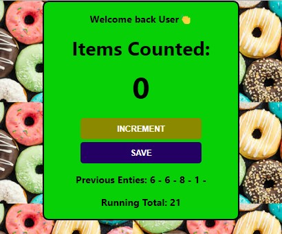

# Item-Counter

## <ins>App for counting items and saving the count

  

## <ins>What it does

Use JS Code and CSS objects to increment counter and save count while providing a running total.

## <ins>How to Run

Load page and use increment counter to increment count and hit save button to save count and return counter back to zero.  Each count will be saved as well as the running total until page is refeshed then all items will be reset.

## <ins>Future improvements

Add reset button instead of refreshing page.  Add popup for user name to insert in dom.

